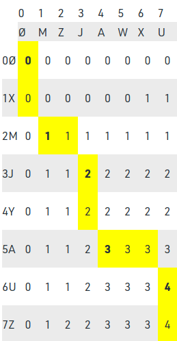
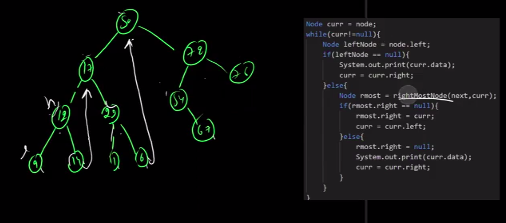
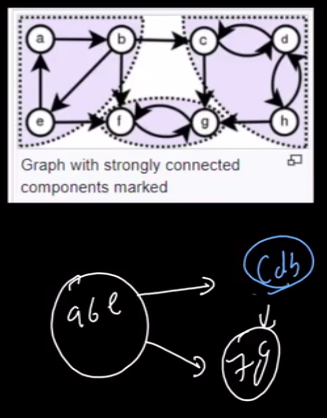

# Quick Revision

1. GFG Must Do Questions

2. Generics Algorithms
    1. Matric Chain Multiplication
    2. Knap Sack
        1. Fractional KnapSack  : Choose Elements with Highest Profit/Weight
        2. 01 KnapSack          : Form a No of Objects x Weight os Object Table
        3. Unbounded KnapSack   : Form a 1 x W table, run a nested loop checking for each object
        <details>
            <summary>Click To Expand</summary>
            
            ```
            for (int i=0; i<=W; i++){
                for (int j=0; j<n; j++){
                    if (wt[j] <= i) dp[i] = max(dp[i], dp[i-wt[j]] + val[j]);
                    }
                }
            ```
        </details>

    3. Job Sequencing           : Sort the Jobs According to the decreasing order of their profits and then sequence the Job at the latest time slot available(before it's deadline and in an then available slot).

    *Assumption : All the Jobs take the same amount of time.*

    4. Optimal Merge Pattern    : Sort the list according to their lengths, merge two smallest list and form another list and once again place it in the overall list, again choose two smallest lists and repeat the process.
    
    **Question:** Merge multiple lists of elements such that the total time taken to complete the Job is minimum.

    *Why This Works : The sorting of lists according to sizes makes the larger lists add the minimum number of times.*

    5. Activity Selection       : Sort the Jobs according to the increasing order of their end time, choose the Job which finishes the first and then move onto the Next.

    
3. Good Questions
    1.  Find Median of 2 Sorted Arrays
    2.  2 Sum, 3 Sum and 4 Sum 
    3.  Reverse a Linked List
    4.  Search In Matrix
    5.  LRU Page Faults             : Vector.erase(iterator) can be used to simplify the approach
    6.  Minimize Height             : Don't Do All the Calculations, Look for Answer instead
    7.  Egg Dropping Puzzle         : Don't Do All the Calculations, Look for Answer instead
    8.  Find Missing & Repeating    : Interesting Answer Approach
    9.  Max Index                   : Sliding Window Variation
    10. Triplet With Sum in Range   : Think of Alternate Aporach if original Approach Fails.
    11. Number Of Islands           : Remember Question's done before not their difficulty, it overwhelms. 
    12. GFG Covid Spread            : Approach might be correct but COde might fail, in this case quickly try the same approach by a different DataStructure or Fresh Code, if that fails too skip the Question and come back to it later.
    13. PreReq Tasks GFG Must Do    :
    14. Jump Game 2 Leet Code       : Sometimes Greedy Aproach is better than DP, Remember similar questions sometime distract from actual approach as we are struck with a totally wrong approach because of percieved familiarity.
    15. Merge Intervals Leet Code
    16. Gray Code Leet Code         : The Gray code has the feature of a single bit switch between consecutive numbers, it also has the added benifit of a difference of 2^itr in the reverse order of traversal of current list.
    17. Declare a comparaotr for Set: 

```
struct comparator{
    bool operator()(const vector<int>&v1,const vector<int>&v2) const{
        // Code
    }
};
```

4. Theory Topics                : MySQL

5. Other Topics
    1. Huffman Coding           : Switch ASCII codes with self codes that one can build using a Huffman Tree, since not al ASCII codes are used in our file.

    2. Prims & Kruskal Algorithm: A Min-Spanning Tree is a subset of a graph such that all the vertices are present in it but with only |N| - 1 edges.

    Thus there will will |E| C |N|-1.

    Prims   : Select the Min Edge and Repeat |N| - 1 times to add connected edges with min weights such that a new vertex is added.

    Kruskal : Select the Min Ege which is not making a cycle, Repeat.

    3. Source Shortest Path     : A way to find the Min path rom source vertex to all other vertex.
        1. Dijikstra Algorithm  : Initially distance to all vertex except the source is set to Infinity while source will ofcourse be zero. Later we all connected vertex and update their distance to the Min(Original Distance, New Connected Vertex + WT of Edge), Repeat.
        2. Bellman Ford Algo    : Repeat for |N| - 1 time, Relax all vertices


            |Bellman Fords|Dijikstra|
            |:---|:---|
            |Works for Negative Edge Weights|Doesn't work for Negative Edge Weight|
            |Dynamic Programming|Greedy Approach|
            |O(V * E)|O(E * log V)|

    4. String Pattern Matching  :
        1. Naive Algo           : A simple nested look. *i will shift back to original i + 1 in case of mis-match*.
                                : O(m * n)
        2. KMP Algorithm        : Prepare a PI table to show the position of preffix that appears sometime before in same string, in case of mismatch fall back to last prefix instead of initial position + 1.
                                : O(n)
        3. Rabin Karp Algo      : Convert the pattern into a hash code, save the length of the pattern and run a loop over the String taking the previously saved number of characters at a time and use that to create and another hash, now compare this hash with the hash of the pattern, continuously add the new character into the hash while removing the previous first one and continue to compare hash until a match is found, when the hash matches, make sure to check the entire pattern then.
                                : O(n - m + 1)

6. Note To Self     :       Always check the Return Type, might be using long over int.

7. Aditya Verma     :

    1. Stack Playlist : **When we are using a Nested Loop, and the j of the second loop is dependent on the i of first loop, then one must think of somehow implementing the Stack.**

        1. Nearest Greater To Left
        2. Nearest Greater To Right : Next Largest Element  : Declare a Stack, Traverse the Array from Right To Left, Check in every turn of loop to see if the element in the stack is greater than the given element, if the stack gets empty without filling the result then put a -1 in it. Finally push the current element into the Stack.

        3. Nearest Smallest To Left : Next Smallest Element
        4. Nearest Smallest To Right

        5. Stock Span Problem       : Save the index of the Greatest element to the left instead of the element itself and use it to calculate the Span of Stocks.
        6. Maximum Area of Histogram: Find the inndex of Nearest Smallest to Left and Nearest Smallest to Right element use the Current Height and the difference in the Span as Width to calculate the Area of Histogram and Maximize it over the Array.

        7. Max Area of Rectangle in Binary Matrix : Traverse through the Matrix to compress the 2-D matrix into the 1-D matrix form by adding the value of 1 level above, the end send the current 1-D matrix to the MAH function made above.

        8. Rain Water Trapping      : First calculate the height of the Greatest building to the Left and Right, their Minima will be the level of water in that region, then subtract the current height of building from the level and add this to the result which was initially Zero.

        9. Implementation of Min Stack : 
        
        With Extra Space    : Use two stack one contains all elements, while the supporting stack will hold elements that are smallest.
        No Extra Space      : Use a variable to save the min element, we will use the Stack for 2 functions, one to store the elements, other to put a flag on when the minEle turns and what it will be.

        ```
        int top(){
            if(s.size() == 0) return -1;

            if(s.top() >= minEle) return s.top();
            else return minEle;
        }

        void pop(){
            if(s.size() == 0) return -1;

            if(s.top() >= minEle) s.pop();
            else{
                minEle = 2 * minEle - s.top();
                s.pop();
            }
        }

        void push(int x){
            if(s.size() == 0){
                s.push(x);
                minEle = x;
            }
            else{
                if(x >= minEle) s.push(x);
                else{
                    s.push(2 * x - minEle);
                    minEle = x;
                }
            }
        }

        ```

        10. Stack using Heap
        11. Celebrity Problem
        12. Longest Valid Palindrome
        13. Iterative TOH

    2. Heap : Condition regarding a variable K, Smallest/Largest/Sorting them the Question is of Heap

        Space Complexity : O(K)
        Time Complexity  : O(N log K)

        1. K Largest Numbers : 

        2. Sort a K Sorted Array : Push the first K elements into the Min Heap, once the size is equal to K, then pop the top element into the Resultant Array in the required postion, continue the loop.

        3. K Closest numbers : Similar to number except the Sorting will be customized as the absolute difference between the number and the given number.

        4. Top K Frequent Numbers : First form a map of element and it's Frequency by traversing the Array to mark each element's Frequency, Then push the Map elements into the Priority Queue as pairs with Frequency as the first element.

        5. Frequency Sort : 

        6. K Closest To Origin :
        
        7. Connect Ropes to Minimize the Cost : Similar to Huffmann Code

        8. Sum Of k1 Smallest and k2 Largest Elements : 

    3. Sliding Window Algorithm : Array/String, Sub Array/String, Largest/Smallest, Variable K

        1. Max SubArray of Size K :
        
        2. First Negative Integer In Window of Size K : Declare 2 Variables End = K and Beg = 0, run a loop until End <= N, in the loop run a sub loop until Beg < End, push A[Beg] if it is less than 0 or push 0 into res if Beg == End at the end of the loop, also if End - K == Beg, increment Beg by 1.
        
        3. Max of All Subarrays of Size K : Declare a priority_queue to hold an element and it's index pair, Run a loop from 0 to N, pushing each element and it's index into the priority_queue with each turn, if the size of the priority_queue >= size of window, check if the index of the element in question is Ok(end - B > index) then push the element into the result vector else keep popping the priority_queue until an element is found.

        4. Largest Sub Array of sum K : Declare a Map to Hold the size and index of subarray from 0 to index sum, run a loop from 0 to N-1, with each time saving the cumalative sum to the Map, further check if the Diff of Curr Cummalative Sum and required sum(K) is present in the Map, if present then that currIndex - index will give the required size, maximize it.

    4. Binary Search : Whenever the Array is sorted in any way, chances are that the Question will use the Binary Search.
        
        1. First and Last Occurence : The normal Binary Search will be used except when the element is found, we will update result and the set beg = mid + 1 instead of using break.

        2. Count the Occurence of Element : Last Occurence - First Occurence + 1

        3. Number of Times an Array is Rotated : Find the index of Min Element : declare beg = 0 and end = N, run for beg < end, mid = (beg + end) / 2, mid to end is sorted, look for beginning index in beg to mid otherwise lookinto mid to end, continue till beg == end, return mid.

        4. Find element in a rotated sorted Array : Find the smallest element index, check where the element might be in which part, and then run normal Binary Search.

        5. Floor in Sorted Array    : 
        6. Ceil in Sorted Array     :

        7. Next Alphabetical Element: Similar to Floor in Sorted Array but with characters.
        8. Find element in an Infinite Array :

        9. First 1 in a Binary Array:

        10. Min Diff element in an Sorted Array : Look for Floor and Ceil, choose the smaller number.
        
        11. Binary Search on Answer : Sometimes the Question has **No array let alone Sorted Array**, still we may **use the Binary Search there**, all we need to do is **look for a Critereon to divide the Range** of Solutions into Half(Left or Right).

        12. Find Max in a Bitonic Array : Too many conditions for every possibility in every Iteration.
        13. Find an Element in Bitonic Array : Divide elment from the Max Element, use binary search on both.

        14. Search in Row wise and Col wise Sorted 2-D Array : Understand the required complexity is O(M+N), visualize how the flow of row and col variables will decrease and increase.

        15. Allocate Min Number Of Pages : Similar to Finding the Square Root : Set High = Sum of All Pages and Low = Num of Pages in Book 1, run loop for Low < High, mid = (low + high) / 2, allocate books to students such that their page sum donot exceed the mid if it increases then start allocation to the next student, if the number of students in this way is greater than the available students set low to mid and continue, else if the number of students is less than the available students set the High to Mid, else return result.

    5. Dynamic Programming : An enhanced form of Recursion. If the problem is using Recursion. At every point we will have a choice eg. In KnapSack we have a choice to add or leave an item. The question asks for Optimality.**The Min/Max is affected when dealing with INT_MAX / INT_MIN as the values will get currupted if a wrong value is added or removed**.

        1. Knap Sack : 
            1. 01 Knap Sack : Items in limited supply and cannot be divided.
                1. Run recursion for each item, either add it to Knap Sack or leave it, call Recursion for each choice, maximize the choice.
                2. Add Memoization to the Recursion.
                3. Build Table. Item No + 1 x Capacity Of Knap Sack.

                4. Variations Based on 01 Knap Sack : 
                    1. Subset Sum
                    2. Equal Sum Partition
                    3. Count of Subset Sum
                    4. Minumum Subset Sum Diff
                    5. Target Sum
                    6. No of Subsets 
            2. Fractional Knap Sack : Simple Greedy approach, Find the items with most Wt/Value. Fill the items with the highest ratio.

            3. Un Bounded Knap Sack : An unlimited supply of items.
                1. Run recursion for each item, you can choose to either take the item or leave it, if you are leaving the item move onto the next otherwise stay on the current index only, maximize this. Stop when the Bag is full.
                2. Add Momoization.
                3. Implement Top Down.

                4. Variations : 
                    1. Rod Cutting
                    2. Coin Change Problem (Number of Ways)
                    3. Coin Change Problem (Min Number of Coins)
                
            4. Longest Common Sub-Sequence : Has max number of Variation. *Problem Statement* : 2 strings are given, choose the lcs(dis-continuous).

                1. Recursion : Run a recursion for S1, S2, x, y. Where x and y are both the positions of the current index in question for the strings. At ech turn if S1[x] == S2[y] then return 1 + rec(x-1, y-1, S1, S2) else return the max of rec(x-1, y, S1, S2) and rec(x, y-1, S1, S2).
                2. Add Memoization.
                3. Implement Top-Down.

                4. Variations : 
                    1. Longest Common Substring : Similar to LCS except the rec call will also have a variable of common until now, if the current characters are equal call the rec with decrementing x and y and incrementing common until now. Else return max(common until now, rec(x-1,y-1, S1, S2, 0)) where 0 is the common until now.

                    2. Print LCS Between two Strings : 
                    

                    3. Shortest Common Super String : The shortest String such that both the input strings A and B are it's Sub-Sequence. Check for curent index if the char are similar add 1 to result and move to rec(x-1, y-1) else we will either print one of the 2 characters and move to rec(x-1,y) or rec(x,y-1), since we will either way print 1 character and are trying for the minimum solution, we will be adding 1 to the result to the minimum of both recursions.
                        1. Recursion : if(x == 0) return y, if(y == 0) return x, if(S1[x] == S2[y]) return 1 + rec(S1, S2, x-1, y-1) else return 1 + min(rec(S1, S2, x-1, y), rec(S1, S2, x, y-1)).
                        2. Memoization
                        3. Top-Down Implementation

                    4. Minimum number of Insertion and Deletion to convert String S1 to S2 : Find the Length of Shortest Super String and LCS, return : (Shortest Common Super String).length() - (Longest Common Sub-Sequence).length()

                    5. Print Shortest Common Super-Sequence : Use Table

                    6. Longest Palindromic SubSequence : Reverse the Given String, find it's LCS with the Original String.
                        1. Variations : 
                            1. Min Number of Deletion to Make String a Palindrome : Length(Original String) - Length(Longest Palindromic Sub-Sequence)

                            2. Longest Repeating SubSequence : Similar to LCS except the Same String is sent as S1 and S2. The only difference is that though the characters have to be same for the increment, their indexes will have to be different aswell.

                            3. Sequence Pattern Matching : Is S1 a subsequence of S2. Find LCS length of S1 and S2 if the length of LCS == length of S1 return true else false.

                            4. Min Number of Insertions to Make String a Palindrome : Length(Original String) - Length(Longest Palindromic Sub-Sequence)
                    

8. Data Structures  :

    1. Binary Tree  : Not linear but Heirarchial data structures, used for data that naturally forms heirarchy eg File Structure.
        1. Application  : Manipulate Heirarchial Data, Router Algorithm, Form multistage decission.
        2. Properties   : 
            Max number of nodes at level 'l' of a Binary Tree is 2 ^ l.
            Max Number of Nodes in a tree of height h is 2 ^ (h+1) - 1.
            Min Height of Binary Tree with n Nodes is log2(n+1).
            Max Height of Binary Tree with n Nodes is N.
            Binary Tree with L leaves have log2(L) + 1.
        3. Types        :
            Full Binary Search Tree : Every node has 2 or 0 children.
            Complete Binary Tree    : Every Level is Filled, except for the last their too all the nodes are at the left.
            Perfect Binary Tree     : Every Level is Filled
            Balanced Binary Tree    : The height of the Binary Tree is log(N).
            Degenerate Tree         : No Condition.
            AVL Tree                : Diff in the Height of Left and Right Subtree is atmost 1.
            Red Black Binary Tree   : Ballanced Binary Tree.

        4. Handshaking Lemma        :
        
        ```
        L = (k - 1) * I + 1
        ```

        5. Level Order Binary Tree Traversal    : Traverse a Binary Tree in level order using Queue, push the New Node into the first NULL you find with Priority Given to the Right Child over Left Child.

        6. Deletion in Binary Tree              : Find the Deepest and the Right Most Node of the Tree, hold it's value and Delete the Node, then find the Node you wish to delete and then Over-write it's value with the Value of the Node you just Deleted.

    2. Queue DS     : Follows FIFO.

        1. Functions of Queue : 
            1. empty()  : Returns true if Queue is empty
            2. size()   : Returns size of Queue
            3. queue::swap(queue) : Exchanges the content of 2 Queues q1.swap(q2)
            4. front()  : Returns element at the Front
            5. back()   : Returns element at the End
            6. push(Element e) : 
            7. pop()    :
            8. emplace(Element e) : Similar to push except that push adds a copy of the object into the Queue while emplace will add the object itself.

        2. Functions of Deque : Double Ended Queue
            1. insert(Iterator it, Element e) : It adds an element to the Queue at the postion pointed by the iterator it, all the elements following and including it will be still present after the new elements.
            2. insert(Iterator it, Number n, Element e) It adds n elements e at the position it.
            3. insert(Iterator it, vector::iterator beg, vector::iterator end) Adds elements of a similar vector at position it.

            4. rbegin() : Reverse Iterator Begin
            5. rend()   : Reverse Iterator End

            ```
            for (auto it = dq.rbegin(); it != dq.rend(); ++it)
            cout << *it << " ";
            ```

            6. max_size() : Max Number of Elements Dequeue can hold
            
            7. assign(Number n, Value v) : Makes a Queue of size n with all elements with v Values.
            8. assign(Iterator beg, Iterator end) : Assigns Values from beg to end.

            9. resize(Size n) : If the size is increased the new values will be 0 while if the size is decreased the values at the end will be removed.

            10. push_front(Element e)
            11. push_back(Element e)
            12. pop_front()
            13. pop_back()

            14. front() : Element at the Front
            15. back()  : Element at the Back

            16. clear() : Removes all Elements
            17. erase(Iterator it) : Remove Element from Specific position
            17. erase(Iterator beg, Iterator end) : Remove Element from Specific range

            18. empty()
            19. size()

            20. = Operator : dequeue1 = dequeue2, makes all the inputs in dequeu2 into dequeue1
            21. [] Operator: dequeue[position] return the element at position

            22. at(Position pos) : 
            23. Queue1.swap(Queue2) :

            24. emplace_front(Element e) and emplace_back(Element e)

        3. Functions of Priority Queue :
        
            1. priority_queue<int> Max Heap : Top has Max Element.
            2. priority_queue<int, vector<int>, greater<int>> Min Heap : Top has Min Element

            1. empty()
            2. size()
            3. top()
            
            4. push()
            5. pop()

            6. swap()
            7. emplace()
            8. value_type() : Returns the type of elements stored.

        4. Functions of List : Simimilar to vectors but slower, functionality like dequeue except : 
            1. reverse()
            2. sort(Iterator begin, Iterator end)
            3. unique() : Removes duplicate consecutive elements
            4. splice(Iterator it, List l2) : Transfer elements of l2 into current list at position it
            5. merge(List l2) : Merges all elemenst of a sorted list l2 into l1.

        5. 

9. Fang 2.0 Pep Coding : 
    1. Graph : 
        1. isBipartite : 
            1. Color Graph : Color current node with one color and all it's neighbours it's complement, then move to the next node and validate if the coloring is correct and possible, if true return true otherwise false.

10. Pep Coding : 
    1. Sparse Table : Size of N x Log(N), helps to query min and max values in an array optimally.
    2. Morris Traversal : Used for Traversal of Binary Tree without using any Stack or Recursion, simply connects the last node back to the Node we need to visit.

    

    3. Tree To Double Ended Queue
    4. Tree To Circular Queue

    5. Topological Order : The question of deciding the order in which Books have to be read incase one book has to be read before the other conditions exist.

    What we need to do is Start from any Node, apply DFS on the node, when there is no way forward, return to the root Node while pushing each vertex back into a stack and then move to another node which has not been visited already, finally Output the content of the Stack into a vector to receive the Topological Sort.

    For Acyclic Directed Graph

    6. Level Order Traversal

    7. Kahn's Algorithm : Helps traverse a Tree according to their Level. First Find the InDegree of all the Nodes ie the Number of Nodes which point to Current Node or the Number of Dependencies of the Node. Now Find all the nodes with Degree 0 and push them into Result, those which have been pushed has to be removed from graph and once removed they will no longer effect the In-Degree of their children, after each remove reduce the in-degree by One of their Child, now whichever Node has degree 0 will be removed from the Graph, continue the process until no Node is left.

    8. KosaRaju Algorithm : 
        1. Strongly Connected Component : If one can reach back to a Node after traversing through the Graph and all the node which were in this Path are capable of doing the Same, then the Node is called a Strongly Connected Component.

        Used to convert a Directed Cyclic Graph to a Directed Acyclic Graph by Converting the Strongly Connected Component as a Single Node.

        

        Longest Increasing Path In a Matrix-LeetCode