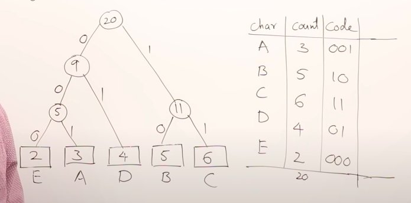
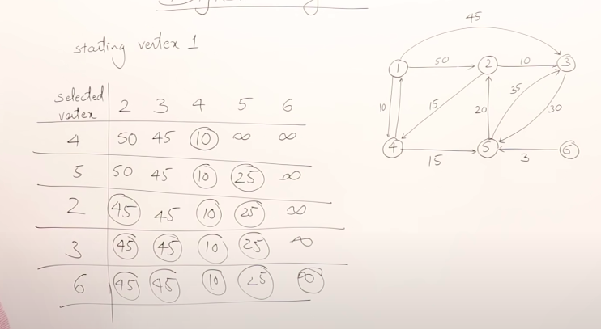

# Abdul Bari

1. Time Complexity
2. Recurrence Relation
3. Master Theoram

## Algorithms

1. Definite(Un-Ambiguous)
2. Finite(Algo Must Stop unlike Program/Service which may Go On)
3. Input
4. Output
5. Effective(Must Work for All the Possible Inputs and Conditions)

**Algorithm vs Program**

|Algorithm|Program|
|:---|:---|
|Made during the Design Time|Made during Programming Time|
|Made by any Person with Domain Knowledge|Done by Developer|
|Hardware and OS Independent|Hardware and OS Dependent|

|Priori Analysis|Posteriori Analysis|
|:---|:---|
|For Algo|For Program|
|Before Development|After Development|
|Hardware and OS Independent|Hardware and OS Dependent|
|Time and Space Complexity|Watch Time and Bytes|

## Sorting Algorithms

1. Insertion Sort
2. Heap Sort
3. Merge Sort
4. Quick Sort

### Greedy Method

1. KnapSack : Sort the Array in the Decreasing order of Profit/WT. Start filling the Knap sack until the Knap Sack is full or the Items have exhausted.

2. Job Sequencing : An Array of Jobs is given, each job has a Profit and Deadline and Each job takes 1 Unit of Time. Sort the Jobs in the decreasing order of Profits. Then Assign the Job to the Latest time when it can be done.

3. Optimal Merge Pattern : N Sorted lists are given and we have to sort them to get a final List. Merge the lists with Minimum number of Elements first to get a new List and add it to the Collection of Lists, again pick 2 Lists of Min Size unitl there is only 1 List left.

4. Huffman Coding : Instead of using ASCII code we use our own codes to reduce the file size, since a file may not be using all the 256 Characters, Sort the Characters according to the Frequency of their Occurence. Higher frequency characters will have a smaller code. Arrange the characters in Increasing order of Frequency. Combine the Codes with the Minimum Frequency to form a new Entry. Repeat until Exhaustion.

### Dynamic Programming

1. MCM

### Graph Algorihms

1. Prims : Greedy Method for MST.
2. Kruskal : Greedy Method for MST.

3. Dijikstra : Find the shortest path from **Single Source** to all Other Vertex. Set all the initial vertext distance to INT_MAX except for SRC which is set to 0 and it's Connected Vertices which will have the Value of their Connecting Edge. Travrse through the Graphm(*in a greedy way ie select the Min path*), **donot Relax a relaxed Edge**, realxing all the Path for d[v] = min(d[v], d[u] + Edge(u, v)).

**Draw Backs** May or Maynot Handle Negatice Edges *In some cases it May Work*.

**Time Complexity** : |V| x |V|

4. Bellman Ford Algo : Find the shortest path from **Single Source** to all Other Vertex. Relax edges for |V| - 1 times, mark all edges as a pair of SRC and DST, relax each DST using the SRC with the formula d[v] = min(d[v], d[u] + Edge(u, v)).

**Draw Backs** May Not handle Negative Weight Cycles, going into a Loop reducing Path for every iteration.

**Note** This however can be used to Detect Negative Weight Cycle.

**Time Complexity** : |V| x |E|, |E| may be n * (n - 1) / 2 where n = |V|, so the order will be of |N| ^ 3.

5. Floyd-Warshal Algorithm : Find the shortest path for Every pair of Vertices. We can use Dijikstra Algo for every Vertex but it will take
|V| ^ 3 Time.

We will be creating |V| + 1 matrices for relaxation of all |V| vertices, except for the 0th Matrix which will simply represent the Graph such that every mat[i][j] = edge weight between the vertex i and j. now move from 1 to |V| matrix while copying the value for i == k || j == k, while the rest of the entries will be relaxes ad mat_k[i][j] = min(mat_k[i][j], mat_k-1[i][k] + mat_k-1[k][j]).

It's Time Complexity is |V|^3 and space complexity of |V|^2

### String Matching Algorithms

1. Naive Algo
2. KMP
3. Rabin Karp

### Misc

1. Binary Search

## Time Complexities

1. **Sorting Algorithms**

|Algorithm|Best|Worst|Average|
|:---|:---|:---|:---|
|Selecion Sort|N x N|N x N|N x N|
|Bubble|N|N x N|N x N|
|Insertion|N|N x N|N x N|
|Heap|N x Log(N)|N x Log(N)|N x Log(N)|
|Quick Sort|N x Log(N)|N x N|N x Log(N)|
|Merge Sort|N x Log(N)|N x Log(N)|N x Log(N)|

2. **Graph Algorithms**

|Algorithms|Time Complexity|
|:---|:---|
|BFS|V+E|
|DFS|V+E|
|Dijikstra(Shortest Path)|N x N or E x log(V)|
|Bellman Ford|V + E x log V|
|Floyd Warshal|N ^ 3|

3. **Tree Algorithms**

|Algorithm|Time Complexity|
|:---|:---|
|Prims|V x V(Adjacency List) E x log V(Binary Heap)|
|Kruskal|E x log V|

4. **String Algo**

|Algorithms|Time Complexity|
|:---|:---|
|Naive|M x N|
|KMP|N|
|Rabin Karp|M + N, M x N|