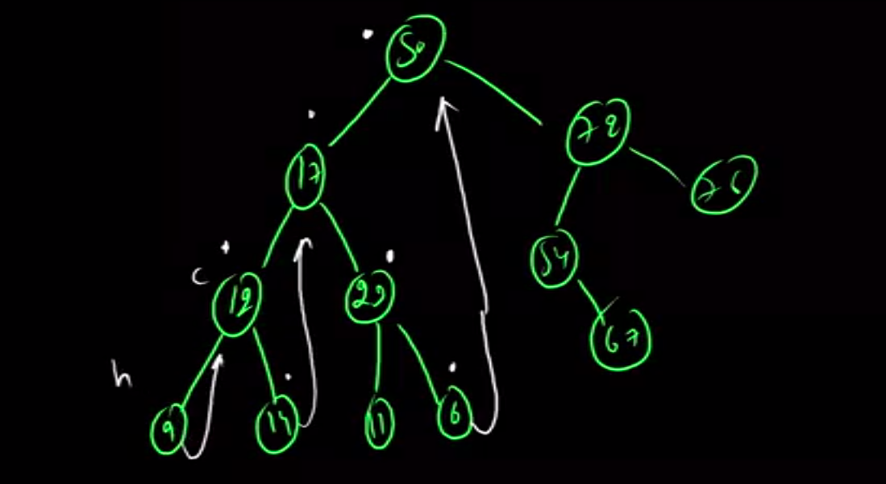
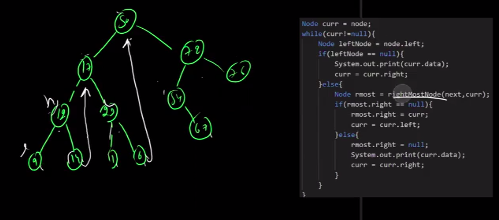

# Pep Coding Level Up

## Class 0 - Hashmap and Heap

## Class 58 - Number Theory

## CLass 68 - Morris Traversal

For Every Node set Current as C and it's Left Child as N, find the left most Node of N and Set it's left as C. And then Move to Next Left Child to continue the Process, if there are no more left Child print the Node data and set the N->left to C.